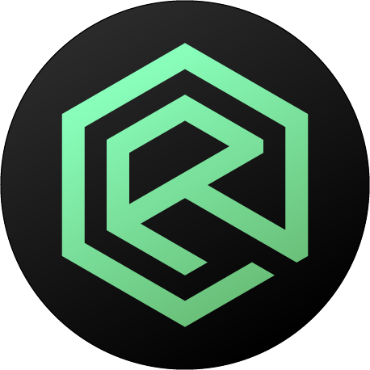

    

<h1 align="center">Rift Systems | Rift</h1>

Rift is an all-in-one server management and moderation, and staff management tool for ERLC based servers, You can use it to do operations like infractions, shift management, sessions, and more! Rift comes both with a free and paid plan. We offer a competitive feature set to other bots in the community.

<h2 align="center">Important Information</h2>

Rift Systems was created by <a href="https://github.com/orgs/Rift-Systems/people/NickDerry2023">@NickDerry2023</a> and <a href="https://github.com/orgs/Rift-Systems/people/JustDizo">@JustDizo</a> to help the community with automation solutions to make server and staff management easier to work with. We saw a need to help the community and decided to act on filling that need.

    
    
    
    
    
    

<h2 align="center">License</h2>

    Rift is distributed under the <strong>Creative Commons Attribution-NonCommercial-ShareAlike 4.0 International (CC BY-NC-SA 4.0)</strong> license.
    This license permits the <strong>copying, distribution, and adaptation</strong> of the material for <strong>non-commercial purposes</strong>, provided that: 

    <strong>Attribution (BY):</strong> Proper credit is given to the original creators. 
    <strong>NonCommercial (NC):</strong> The material is not used for commercial purposes. 
    <strong>ShareAlike (SA):</strong> Any derivative works are licensed under identical terms. 

    For the complete legal text, please refer to the official 
    <a href="https://creativecommons.org/licenses/by-nc-sa/4.0/legalcode" target="_blank">CC BY-NC-SA 4.0 Legal Code</a>.

  

